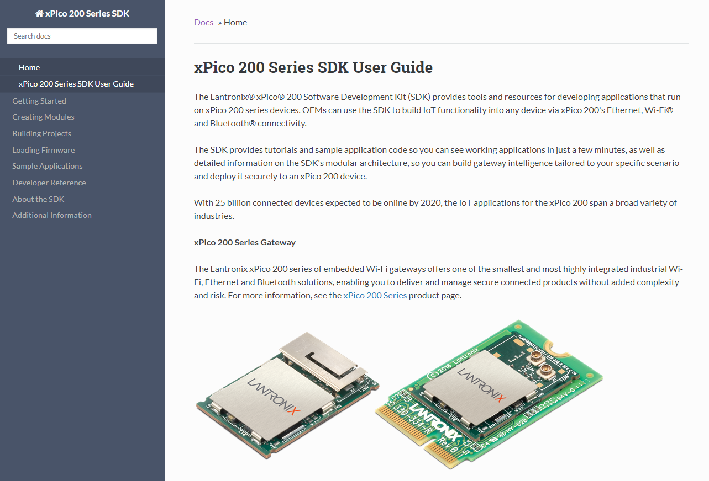
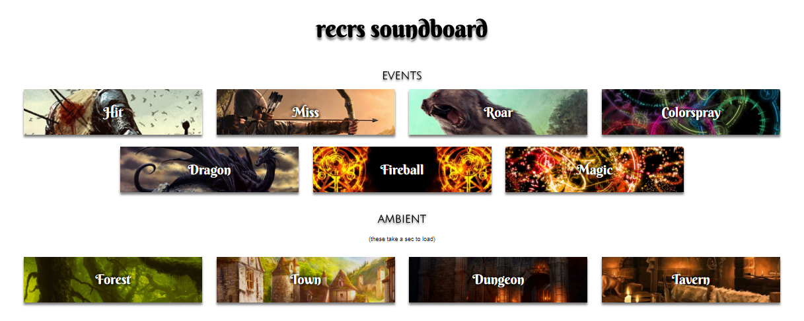

Hi! Thanks for reviewing my portfolio. Below are my techical documentation projects.

# xPico200 SDK

This [SDK guide](https://docs.lantronix.com/products/xpico-200/sdk/1.7/) teaches SDK users how to create, build, and  deploy firmware to an embedded gateway device. Here's what's included:

* Overview of the SDK's modular/component-based architecture, and steps to [create modules](https://docs.lantronix.com/products/xpico-200/sdk/1.7/modules/), [build projects](https://docs.lantronix.com/products/xpico-200/sdk/1.7/projects/), and [load firmaware](https://docs.lantronix.com/products/xpico-200/sdk/1.7/firmware/).
* Detailed information about what is happening in the C-language code used in the [sample applications](https://docs.lantronix.com/products/xpico-200/sdk/1.7/sample-apps/).
* An automatically-generated [developer reference](https://docs.lantronix.com/products/xpico-200/sdk/1.7/dev-ref/) that includes function documentation for all modules, including descriptions, parameters, data types, and return types. Additionally, the developer reference includes information about data structures and header files. This documentation is generated by Doxygen as as HTML output, and then manipulated using Python to prepare the HTML for inclusion in the SDK Guide files.
* [Getting started](https://docs.lantronix.com/products/xpico-200/sdk/1.7/getting-started/) content, with quick-start tutorials that let users build and deploy working firmware in just a few clicks. 

# FoodTruck API

This [API documentation](https://mollieswenson.github.io/slate/) includes Node (JavaScript), Python, and cURL code samples for all GET, POST, PUT, and DELETE API operations, as well as information on authentication, errors, and an overview. It is written in Markdown and published using Slate.

I wrote the code for the FoodTruck API as part of a course on API development! It uses Node with Express and MongoDB. See the [code on GitHub](https://github.com/mollieswenson/foodtruck-api).

# Video Search App

This [React component wiki](https://github.com/mollieswenson/react-video-search-app/wiki) documents the React components used in a video search app, including property name, type, description, initial state, and state change functions. It's written in Markdown and published using GitHub Wiki.

I wrote this app as part of a course on React. It makes calls to the YouTube API and updates the search results as the user types. See the [code on GitHub](https://github.com/mollieswenson/react-video-search-app).

# Therapist Bot App

This [code documentation](https://github.com/mollieswenson/therapist-bot/#therapist-bot-code-docs) records the constants, functions, and enumerations used in the JavaScript code of this application. It's written in Markdown and published as the project readme.

I wrote this app for a course on code documentation. The app is a (mildly rude) therapist who is happy to discuss your problems for hours on end. A working [demo therapy session](https://mollieswenson.github.io/therapist-bot/) and the [code](https://github.com/mollieswenson/therapist-bot) are on GitHub.

# Soundboard App

I wrote this [soundboard app](https://mollieswenson.github.io/soundboard/) so that my D&D group could have a cool soundboard when we get together. It uses JavaScript, jQuery, HTML, and CSS. The [source](https://github.com/mollieswenson/soundboard) is on GitHub. 

# More Projects

The above projects best represent my current skills and career direction. However, I have several other samples if you'd like to see more.

[Tutorial Video for Minecraft Residence Plugin](https://www.youtube.com/watch?v=u6EY6Xi0fcM&index=4&list=PL750FA9D10C3FE159): I had a Minecraft server and YouTube channel where I posted videos about it. This one describes how to use commands for a plugin available on the server. The audience is a bunch of fairly young gamers who are already familiar with typing commands with parameters.

[Account Access Quick Start Guide](resources/okta-quick-start.pdf): This quick start guide walks employees through the process of using OKTA (single sign-on tool) to access their account. This guide was used by all employees during a company-wide transition and assumed some users were not very technical.

[Google Apps eLearning](resources/google-apps-elearning.pdf): This eLearning course was created using Articulate Studio. It's purpose was to prepare about 15,000 employees for a company-wide transition of several communication and collaboration tools.

[Google Apps Instructor-Led Training](resources/google-apps-presentation.pdf): This live-training presentation was presented as part of live company-wide transition of several communication and collaboration tools. The PDF includes notes for the instructor to read during the presentation.

# Skills

- Work in deadline-driven Agile software development environments
- Interact with various teams to obtain an in-depth understanding of products and processes
- Conceptualize, define, schedule, and manage projects through delivery
- Work in Markdown, HTML, CSS, JSON, XML/DITA, structured authoring environments
- Knowledge of JavaScript/ES6, Node, Express, React, Redux, MongoDB, NPM
- Read and write code samples in C, JavaScript, Python, and other C-family languages
- Version control and collaboration tools; Confluence, JIRA, GitHub/Git, SharePoint, Subversion
- Open tools; Doxygen, Swagger, OpenAPI, Postman, cURL, Mkdocs, Slate, Redoc, JSdoc, Sublime, Atom
- Enterprise tools; Flare, Dreamweaver, Snagit, Photoshop, FrameMaker, Articulate, MS Office
- Adhere to a style guide, familiar with Microsoft Manual of Style for Technical Publications

# Education

**Certificate in Technical Writing @ University of California, Riverside**

- Technical Writing Project Management
- Documenting Policies and Procedures
- Creating Manuals and User Guides
- Technical Writing for Online Documentation
- Technical Writing Seminar

**Completed Programming/API Technical Writing Courses @ Udemy.com**

- Beginner API Development in Node, Express, ES6, and MongoDB
- The Art of API Documentation
- Learn API Technical Writing: JSON and XML for writers
- Learn API Technical Writing: REST for Writers
- Coding for Writers: Basic Programming (JavaScript)

**Bachelor of Arts in English @ San Francisco State University**
